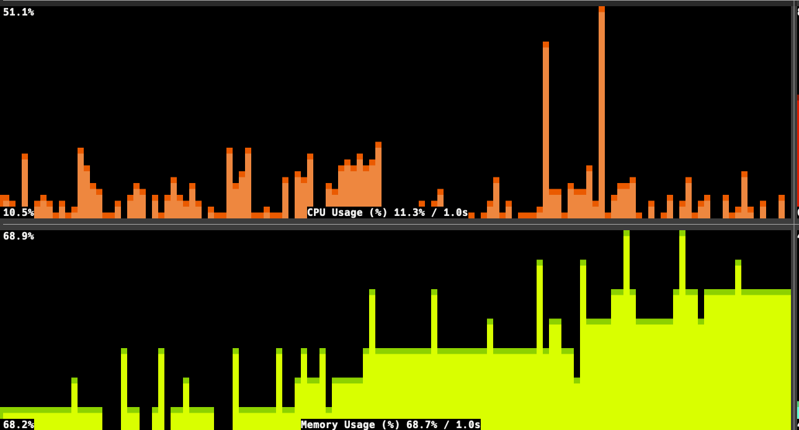

# Graphina 📊📈

## Description

A Ruby gem for creating terminal-based data visualizations with real-time
graphical displays using Unicode characters and ANSI styling 🎨📊

## Screenshots (run in tmux)



## Documentation

Complete API documentation is available at: [GitHub.io](https://flori.github.io/graphina/)

## Features

- **Real-time Data Visualization**: Create dynamic, continuously updating
  graphs in terminal environments
- **Unicode Graphics**: Utilize Unicode block characters for high-resolution
  terminal graphics (2px vertical resolution)
- **ANSI Color Support**: Full color management with 256-color and true-color
  (24-bit) support
- **Multiple Display Modes**: Single and double resolution modes for different
  terminal capabilities
- **Flexible Data Sources**: Support for custom data providers via Proc objects
- **Multiple Formatting Options**: Built-in formatters for bytes, hertz,
  celsius, and percentage values
- **Efficient Rendering**: Delta-based updates to minimize terminal I/O
  overhead
- **Signal Handling**: Graceful shutdown and terminal resize handling
- **String-based Color Derivation**: Automatically derive consistent colors
  from titles and labels
- **Panel Configuration System**: Predefined panel configurations for reuse
- **Interactive Selection**: Choose from available panels with fuzzy matching

## Installation

Add this gem to your Gemfile:

```ruby
gem 'graphina'
```

And install it using Bundler:

```bash
bundle install
```

Or install the gem directly:

```bash
gem install graphina
```

## Usage

### 1. Basic Usage with Random Data

```bash
# Simple usage with random data
graphina
```

### 2. Custom Title and Text Colors

```bash
# Custom title with specific colors
graphina -t "CPU Usage (faked)" -f blue -b black
```

### 3. More complex CPU Usage Monitoring example

```bash
# Monitor CPU usage in real-time
graphina -t 'CPU Usage' -n 1 -F as_percent -e "top -l 1 -n 0 | grep 'CPU usage' | awk '{print \$3+\$5}' | sed 's/%//'"
```

### 4. Using Predefined Panels

```bash
# Use a predefined panel configuration
graphina -P cpu

# Interactive panel selection
graphina
```

### 5. Custom Data Source

```ruby
# Using the library directly in Ruby code
require 'graphina'

graph = Graphina::Graph.new(
  title: 'CPU Usage',
  value: ->(i) { rand(100) },
  format_value: :as_percent,
  sleep: 1,
  color: 33
)
graph.start
```

### 6. Custom Command with External Data

```ruby
# Using external command for data
graph = Graphina::Graph.new(
  title: 'Temperature',
  value: ->(i) { `sensors | grep 'Tctl' | awk '{print \$2}'`.to_f },
  format_value: :as_celsius,
  sleep: 2
)
graph.start
```

## Panel Configuration

Graphina now supports predefined panel configurations. Create a `panels.yml`
file in your configuration directory (`"$XDG_CONFIG_HOME/graphina"`, usually
`~/.config/graphina/panels.yml`) to define reusable panel setups:

```yaml
cpu_usage_percentage:
  title: "CPU Usage (%)"
  interval: 1
  command: "top -l 1 -n 0 | awk '/^CPU usage:/ { printf \"%.1f\", $3 + $5 }'"
  format_value: as_percent
  color: '#ff5f00'
memory_usage:
  title: "Memory Usage"
  interval: 1
  command: "free -b | awk '/^Mem:/ { print $4 }'"
  format_value: as_bytes
  color: '#00d787'
  color_secondary: '#00ffd7'
memory_usage_percentage:
  title: "Memory Usage (%)"
  interval: 1
  command: "free -b | awk '/^Mem:/ { printf \"%.1f\", 100 * $4 / $2 }'"
  format_value: as_percent
  color: '#87d700'
  color_secondary: '#d7ff00'
cpu_temperature:
  title: "CPU Temperature ℃ "
  interval: 1
  command: "osx-cpu-temp -C | tr -dc '0-9.'"
  format_value: as_celsius
  color: '#aa0000'
```

To use a specific panel:
```bash
graphina -P cpu
```

To see all available panels:
```bash
graphina
```

## Command Line Options

```
Usage: graphina [OPTIONS]

  OPTIONS are

    -t TITLE      Title for the graph (default: 'Data')
    -n SECONDS    Update interval in seconds (default: 5)
    -r MODE       Resolution mode (:single or :double, default: :double)
    -f COLOR      Foreground color (default: :white)
    -b COLOR      Background color (default: :black)
    -c COLOR      Primary color (default: derived from title)
    -C COLOR      Secondary color (default: derived from primary)
    -F FORMAT     Format function (:as_bytes, :as_hertz, :as_celsius, :as_percent, :as_default, default: :as_default)
    -e COMMAND    External command to execute for data values (default: random data)
    -P PANEL      Panel name to use from configuration (default: interactive selection)
    -h            this help
```

## Author

[Florian Frank](mailto:flori@ping.de) 🧑‍💻

## License

[MIT License](./LICENSE) 📄
